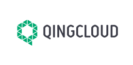

OpenELB has been adopted by many companies. If you are using OpenELB in your organization, welcome to join the end user community and add your logo to the list!
                                                 

