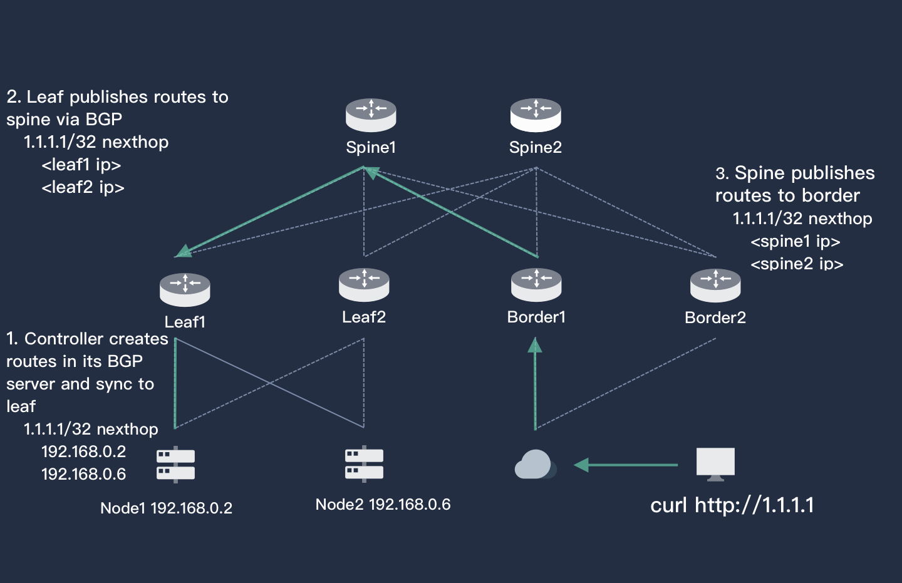

# Porter

> English | [中文](README_zh.md)

## What is Porter

[Porter](https://porter.kubesphere.io/) is an open source load balancer designed for bare metal Kubernetes clusters. It's implemented by physical switch, and uses BGP and ECMP to achieve the best performance and high availability.

## Why Porter

As we know, In the cloud-hosted Kubernetes cluster, the cloud providers (AWS, GCP, Azure, etc.) usually provide the Load Balancer to assign IPs and expose the service to outside.

However, the service is hard to expose in a bare metal cluster since Kubernetes does not provide a load-balancer solution for bare metal environment. Fortunately, Porter allows you to create Kubernetes services of type "LoadBalancer" in bare metal clusters, which makes you have consistent experience with the cloud.

## Core Features

- ECMP routing load balancing
- BGP dynamic routing configuration
- EIP management
- LoadBalancerIP assignment in Kubernetes services
- Installation with Helm Chart
- Dynamic BGP server configuration through CRD
- Dynamic BGP peer configuration through CRD

## Principle

The following figure describes the principle of Porter. Assuming there is a distributed service deployed on node1 (192.168.0.2) and node2 (192.168.0.6). The service needs to be accessed through EIP `1.1.1.1`. After deploying the Example Service, Porter will automatically synchronize routing information to the leaf switch, and then synchronize to the spine and border switch, thus external users can access the service through EIP `1.1.1.1`.

## Deployment Architecture

Porter serves as a Load-Balancer plugin, monitoring the changes of the service in the cluster through a `Manager`, and advertises related routes. At the same time, all the nodes in the cluster are deployed with an agent. Each time an EIP is used, a host routing rule will be added to the host, diverting the IP packets sent to the EIP to the local.

### Components

Porter has two components:

- LB Controller & Agent: The controller is responsible for synchronizing BGP routes to the physical switch; The agent is deployed to each node as DaemonSet to maintain the drainage rules;

- EIP service, including the EIP pool management and EIP controller, the controller is responsible for dynamically updating the EIP information of the service.

## Logic

When Porter is deployed as a service in Kubernetes cluster, it establishes a BGP connection with the cluster's border router (Layer 3 switch). When a service with a specific annotation (e.g. `lb.kubesphere.io/v1apha1: porter`) has been created in the cluster, the service is dynamically assigned an EIP (users can also specify EIP by themselves). The LB controller creates a route and forwards the route to the public network (or private network) through BGP, so that the service can be accessed externally.

The Porter LB controller is a custom controller based on the [Kubernetes controller runtime](https://github.com/kubernetes-sigs/controller-runtime), which automatically update the routing information by watching changes of the service.

## Installation

1. [Deploy Porter on Bare Metal Kubernetes Cluster](doc/deploy.md)
2. [Test Porter with a Simulated Router](doc/simulate_with_bird.md)

## Build

See [How to Build Porter Project](doc/how-to-build.md) for more details.

## Compared with MetalLB

Apparently, Porter is similar to MetalLB, both are service proxy, and they are designed for bare metal Kubernetes clusters as well.

### Pros
- Support most BGP features and multiple network architectures.
- A Kubernetes-friendly tool based on CRD-Controller that can be controlled entirely by kubectl.
- The configuration file can be updated dynamically without any restart. BGP configurations are automatically updated based on the network environment. Various BGP features can be dynamically adopted.
- Provide Passive mode and support DNAT.
- Conflicts with Calico can be handled in a more friendly way.

### Cons
- Support Linux only.

## Documentation

- [Porter Documentation (En)](doc)
- [Porter Documentation (中)](doc/zh)

## Landscapes

  
&nbsp;&nbsp;&nbsp;&nbsp;
  
Porter is a promising newcomer in service proxy, which enriches the <a href="https://landscape.cncf.io/landscape=observability-and-analysis&license=apache-license-2-0">CNCF CLOUD NATIVE Landscape.
</a>

## License

**Porter** is licensed under the Apache License, Version 2.0. See [LICENSE](./LICENSE) for the full license text.
