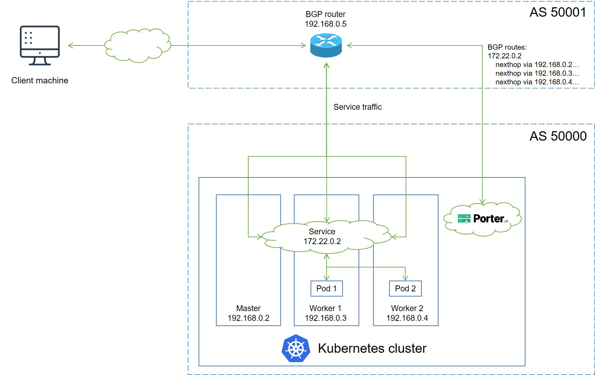

# BGP Mode Network Topology

This document describes the network topology of Porter in BGP mode and how Porter functions in BGP mode.

## Network Topology

The following figure shows the topology of the network between a Kubernetes cluster where Porter is installed and a peer BGP router.

IP addresses and Autonomous System Numbers (ASNs) in the preceding figure are examples only. The topology is described as follows:

* A service backed by two pods is deployed in the Kubernetes cluster, and is assigned an IP address 172.22.0.2 for external access.
* Porter installed in the Kubernetes cluster establishes a BGP connection with the BGP router, and publishes routes destined for the service to the BGP router.
* When an external client machine attempts to access the service, the BGP router load balances the traffic among the master, worker 1, and worker 2 nodes based on the routes obtained from Porter. After the service traffic reaches a node, kube-proxy can further forward the traffic to other nodes for load balancing (both pod 1 and pod 2 can be reached over kube-proxy).

Porter uses [GoBGP](https://github.com/osrg/gobgp) (integrated in Porter) to establish a BGP connection for route publishing. Two [CustomResourceDefinitions (CRDs)](https://kubernetes.io/docs/tasks/extend-kubernetes/custom-resources/custom-resource-definitions/), BgpConf and BgpPeer, are provided for users to configure the local and peer BGP properties on Porter. BgpConf and BgpPeer are designed according to the [GoBGP API](https://github.com/osrg/gobgp/blob/master/api/gobgp.pb.go). For details about how to use BgpConf and BgpPeer to configure Porter in BGP mode, see [Configure Porter in BGP Mode](./configure-porter-in-bgp-mode.md).