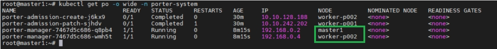

# Configure Multiple Porter Replicas 

This document describes how to configure multiple Porter replicas to ensure high availability in a production environment. You can skip this document if Porter is used in a test environment. By default, only one Porter replica is installed in a Kubernetes cluster.

* If all Kubernetes cluster nodes are deployed under the same router (BGP mode or Layer 2 mode), you are advised to configure at least two Porter replicas, which are installed on two Kubernetes cluster nodes respectively.
* If the Kubernetes cluster nodes are deployed under different leaf routers (BGP mode only), you are advised to configure at least two Porter replicas (one replica for one node) under each leaf router. For details, see [Configure Porter for Multi-router Clusters](./configure-porter-for-multi-router-clusters.md).

## Prerequisites

You need to prepare a Kubernetes cluster where Porter has been installed. For details, see [Install Porter on Kubernetes (kubectl and Helm)](./install-porter-on-kubernetes.md) and [Install Porter on KubeSphere (Web Console)](./install-porter-on-kubesphere.md).

## Procedure



The node names and namespace in the following steps are examples only. You need to use the actual values in your environment.



1. Log in to the Kubernetes cluster and run the following command to label the Kubernetes cluster nodes where Porter is to be installed:

   ```bash
   kubectl label --overwrite nodes master1 worker-p002 lb.kubesphere.io/v1alpha1=porter
   ```

   

   In this example, Porter will be installed on master1 and worker-p002.

   

2. Run the following command to scale the number of porter-manager pods to 0:

   ```bash
   kubectl scale deployment porter-manager --replicas=0 -n porter-system
   ```

3. Run the following command to edit the porter-manager deployment:

   ```bash
   kubectl edit deployment porter-manager -n porter-system
   ```

4. In the porter-manager deployment YAML configuration, add the following fields under `spec.template.spec`:

   ```yaml
   nodeSelector:
     kubernetes.io/os: linux
     lb.kubesphere.io/v1alpha1: porter
   ```

5. Run the following command to scale the number of porter-manager pods to the required number (change the number `2` to the actual value):

   ```bash
   kubectl scale deployment porter-manager --replicas=2 -n porter-system
   ```

6. Run the following command to check whether Porter has been installed on the required nodes.

   ```bash
   kubectl get po -n porter-system -o wide
   ```

   



* In Layer 2 mode, Porter uses the leader election feature of Kubernetes to ensure that only one replica responds to ARP/NDP requests. 
* In BGP mode, all Porter replicas will respond to the BgpPeer configuration and attempt to establish a BGP connection with the peer BGP router by default. If the Kubernetes cluster nodes are deployed under different routers, you need to perform further configuration so that the Porter replicas establish BGP connections with the correct BGP routers. For details, see [Configure Porter for Multi-router Clusters](./configure-porter-for-multi-router-clusters.md).

