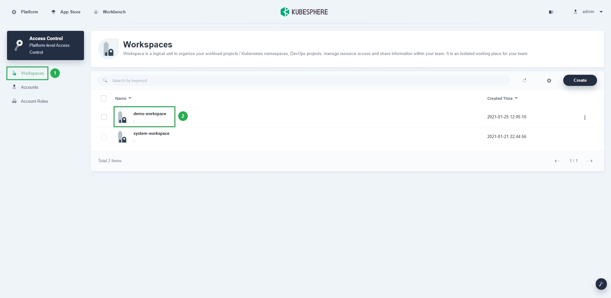
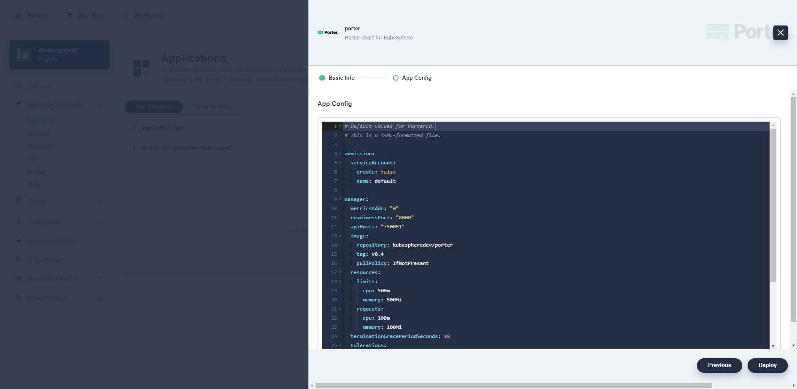
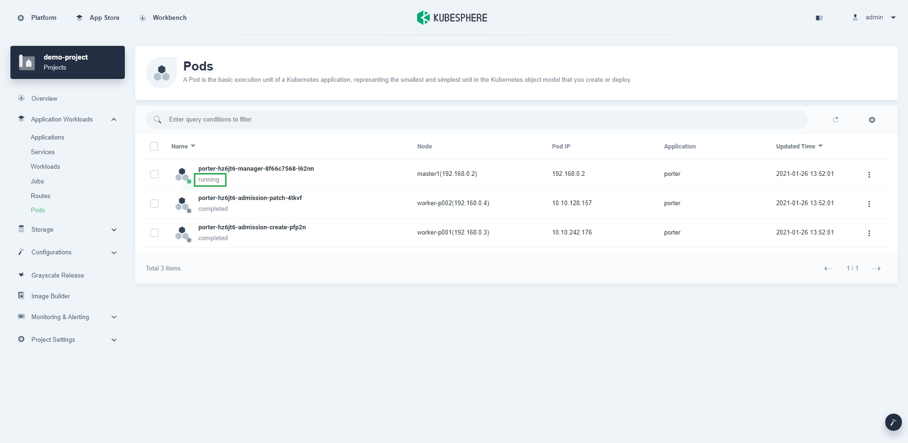

# Install Porter on KubeSphere (Web Console)

This document describes how to install Porter on the [KubeSphere](https://kubesphere.io/) web console. For details about how to install Porter in a Kubernetes cluster without KubeSphere, see [Install Porter on Kubernetes (kubectl and Helm)](./install-porter-on-kubernetes.md).

## Prerequisites

You need to prepare a Kubernetes cluster with KubeSphere, and ensure that the Kubernetes version is 1.15 or later. Porter requires CustomResourceDefinition (CRD) v1, which is only supported by Kubernetes 1.15 or later. You can use the following methods to install KubeSphere:

* [Deploy a new Kubernetes cluster with KubeSphere](https://kubesphere.io/docs/installing-on-linux/).
* [Install KubeSphere in an existing Kubernetes cluster](https://kubesphere.io/docs/installing-on-kubernetes/).

Porter is designed to be used in bare-metal Kubernetes environments. However, you can also use a cloud-based Kubernetes cluster for learning and testing.

## Install Porter on the KubeSphere Web Console

1. Log in to the KubeSphere console and go to your workspace.

   

2. On the left navigation bar, choose **Apps Management** > **App Repos**, and click **Add Repo** on the right.

   

3. In the displayed dialog box, set **App Repository Name** (for example, `KubeSphere-test`), set **URL** to `https://charts.kubesphere.io/test`, click **Validate** to check the URL, and click **OK**.

   

4. Go to your project, choose **Application Workloads** > **Applications** on the left navigation bar, and click **Deploy New Application** on the right.

   

5. In the displayed dialog box, click **From App Templates**.

   

6. Select **KubeSphere-test** from the drop-down list and click **porter**.

   

7. Click **Deploy** and follow the wizard instructions to complete the installation. You can customize the chart configuration in the YAML file based on your requirements.

   

   

8. Choose **Application Workloads** > **Pods** on the left navigation bar to check whether the status of porter-manager is **running**. If yes, porter has been installed successfully.

   

9. To delete Porter on the KubeSphere web console, choose **Application Workloads** > **Applications** on the left navigation bar, click  on the right of the Porter application, and choose **Delete** from the drop-down list.

   

   

   Before deleting Porter, you must first delete all services that use Porter.

   