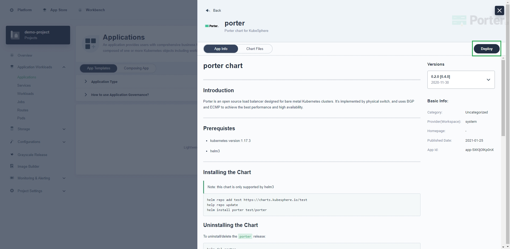

# Install Porter

This document describes how to install Porter in a Kubernetes cluster.

## Prerequisites

You need to prepare a Kubernetes cluster and ensure that the Kubernetes version is 1.15 or later. Porter requires CustomResourceDefinition (CRD) v1, which is only supported by Kubernetes 1.15 or later. You can use the following methods to deploy a Kubernetes cluster:

* Use [KubeKey](https://kubesphere.io/docs/installing-on-linux/introduction/multioverview/) (recommended).
* Follow [official Kubernetes guides](https://kubernetes.io/docs/home/).

Porter is designed to be used in bare-metal Kubernetes environments. However, you can also use a cloud-based Kubernetes cluster for learning and testing.

## Install Porter Using kubectl

Log in to the Kubernetes cluster over SSH and run the following command:

```bash
kubectl apply -f https://raw.githubusercontent.com/kubesphere/porter/master/deploy/porter.yaml
```

## Install Porter Using Helm Charts

Log in to the Kubernetes cluster over SSH and run the following commands:

```bash 
helm repo add test https://charts.kubesphere.io/test
helm repo update
helm install porter test/porter
```

## Install Porter on KubeSphere

If you have deployed [KubeSphere](https://kubesphere.io/docs/installing-on-linux/introduction/multioverview/#step-3-create-a-cluster), you can install Porter on the KubeSphere console. For more information about KubeSphere, visit the [official KubeSphere website](https://kubesphere.io/).

1. Log in to the KubeSphere console and go to your workspace.

   

2. On the left navigation bar, choose **Apps Management** > **App Repos**, and click **Add Repo** on the right.

   

3. In the displayed dialog box, set **App Repository Name** (for example, `KubeSphere-test`), set **URL** to `https://charts.kubesphere.io/test`, click **Validate** to check the URL, and click **OK**.

   

4. Go to your project, choose **Application Workloads** > **Applications** on the left navigation bar, and click **Deploy New Application** on the right.

   

5. In the displayed dialog box, click **From App Templates**.

   

6. Select **KubeSphere-test** from the drop-down list and click **porter**.

   

7. Click **Deploy** and follow the wizard instructions to complete the installation. You can customize the chart configuration in the YAML file based on your requirements.

   

   