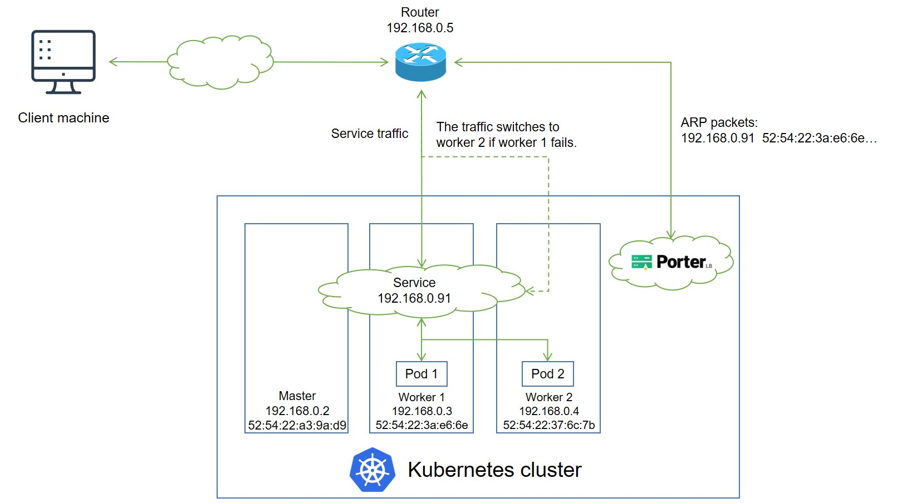

# Layer 2 Mode Network Topology

This document describes the network topology of Porter in Layer 2 mode and how Porter functions in Layer 2 mode.

Generally, you are advised to use the BGP mode because it allows you to create a high availability system free of failover interruptions and bandwidth bottlenecks. However, BGP may be unavailable in certain systems because of security requirements or because the router does not support BGP. In this case, you can use Porter in Layer 2 mode to achieve similar functionality.

## Network Topology

The following figure shows the topology of the network between a Kubernetes cluster with Porter and a router.

IP addresses and MAC addresses in the preceding figure are examples only. The topology is described as follows:

* A service backed by two pods is deployed in the Kubernetes cluster, and is assigned an IP address 192.168.0.91 for external access. The service IP address is on the same network segment as the cluster node IP addresses.
* Porter installed in the Kubernetes cluster randomly selects a node (worker 1 in this example) to handle service requests. After that, Porter sends an ARP/NDP packet to the router, which maps the service IP address to the MAC address of worker 1.
* If multiple porter-manager replicas have been deployed in the cluster, Porter uses the leader election feature of Kubernetes to ensure that only one replica responds to ARP/NDP requests. 
* When an external client machine attempts to access the service, the router forwards the service traffic to worker 1 based on the mapping between the service IP address and the MAC address of worker 1. After the service traffic reaches worker 1, kube-proxy can further forward the traffic to other nodes for load balancing (both pod 1 and pod 2 can be reached over kube-proxy).
* If worker 1 fails, Porter re-sends an APR/NDP packet to the router to map the service IP address to the MAC address of worker 2, and the service traffic switches to worker 2.



The Layer 2 mode has two limitations:

* Worker 1 and worker 2 work in active-standby mode in terms of traffic forwarding. When a failover occurs, services in the Kubernetes cluster will be interrupted for a short while.
* All service traffic is always sent to one node first and then forwarded to other nodes over kube-proxy in a second hop. Therefore, the service bandwidth is limited to the bandwidth of a single node, which causes a bandwidth bottleneck.


