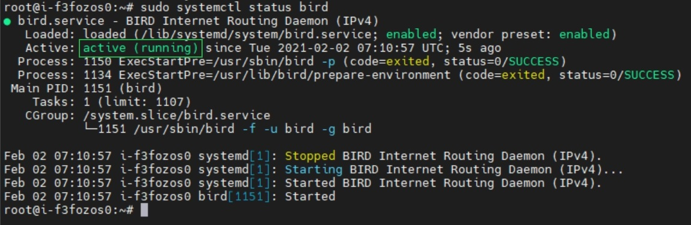
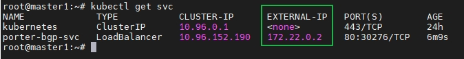
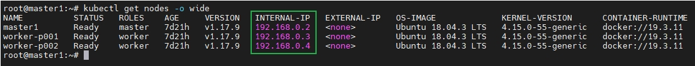
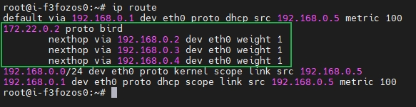
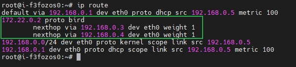
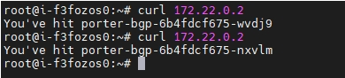

# Use Porter in BGP Mode

This document demonstrates how to use Porter in BGP mode to expose a service backed by two pods. The BgpConf, BgpPeer, Eip, deployment and service described in this document are examples only and you need to customize the commands and YAML configurations based on your requirements.

Instead of using a real router, this document uses a Linux server with [BIRD](https://bird.network.cz/) to simulate a router so that users without a real router can also use Porter in BGP mode for tests.

## Prerequisites

* You need to prepare a Kubernetes cluster where Porter has been installed. For details, see [Install Porter on Kubernetes (kubectl and Helm)](./install-porter-on-kubernetes.md) and [Install Porter on KubeSphere (Web Console)](./install-porter-on-kubesphere.md).

* You need to prepare a Linux server that communicates with the Kubernetes cluster properly. BIRD will be installed on the server to simulate a BGP router. 
* If you use a real router instead of BIRD, the router must support BGP and Equal-Cost Multi-Path (ECMP) routing. In addition, the router must also support receiving multiple equivalent routes from the same neighbor.

This document uses the following devices as an example:

| Device Name | IP Address  | Description                                                  |
| ----------- | ----------- | ------------------------------------------------------------ |
| master1     | 192.168.0.2 | Kubernetes cluster master, where Porter is installed.        |
| worker-p001 | 192.168.0.3 | Kubernetes cluster worker 1                                  |
| worker-p002 | 192.168.0.4 | Kubernetes cluster worker 2                                  |
| i-f3fozos0  | 192.168.0.5 | BIRD machine, where BIRD will be installed to simulate a BGP router. |

## Step 1: Install and Configure BIRD

If you use a real router, you can skip this step and perform configuration on the router instead.

1. Log in to the BIRD machine and run the following commands to install BIRD:

   ```bash
   sudo add-apt-repository ppa:cz.nic-labs/bird
   sudo apt-get update 
   sudo apt-get install bird
   sudo systemctl enable bird 
   ```

   

   * BIRD 1.5 does not support ECMP. To use all features of Porter, you are advised to install BIRD 1.6 or later.
   * The preceding commands apply only to Debian-based OSs such as Debian and Ubuntu. On Red Hat-based OSs such as RHEL and CentOS, use [yum](https://access.redhat.com/solutions/9934) instead.
   * You can also install BIRD according to the [official BIRD documentation](https://bird.network.cz/).

   

2. Run the following command to edit the BIRD configuration file:

   ```bash
   vi /etc/bird/bird.conf
   ```

3. Configure the BIRD configuration file as follows:

   ```conf
   router id 192.168.0.5;
   
   protocol kernel {
       scan time 60;
       import none;
       export all;
       merge paths on;
   }
   
   protocol bgp neighbor1 {
       local as 50001;
       neighbor 192.168.0.2 port 17900 as 50000;
       source address 192.168.0.5;
       import all;
       export all;
       enable route refresh off;
       add paths on;
   }
   ```

   

   * For test usage, you only need to customize the following fields in the preceding configuration:

     `router id`: Router ID of the BIRD machine, which is usually set to the IP address of the BIRD machine.

     `protocol bgp neighbor1`:

     * `local as`: ASN of the BIRD machine, which must be different from the ASN of the Kubernetes cluster.
     * `neighbor`: Master node IP address, BGP port number, and ASN of the Kubernetes cluster. Use port `17900` instead of the default BGP port `179` to avoid conflicts with other BGP components in the system.
     * `source address`: IP address of the BIRD machine.

   * If multiple nodes in the Kubernetes are used as BGP neighbors, you need to configure multiple BGP neighbors in the BIRD configuration file. 

   * For details about the BIRD configuration file, see the [official BIRD documentation](https://bird.network.cz/).

   

4. Run the following command to restart BIRD:

   ```bash
   sudo systemctl restart bird 
   ```

5. Run the following command to check whether the status of BIRD is active:

   ```bash
   sudo systemctl status bird
   ```

   

   

   If the status of BIRD is not active, you can run the following command to check the error logs:

   ```bash
   journalctl -f -u bird
   ```

   

## Step 2: Create a BgpConf Object

The BgpConf object is used to configure the local (Kubernetes cluster) BGP properties on Porter.

1. Run the following command to create a YAML file for the BgpConf object:

   ```bash
   vi porter-bgp-conf.yaml
   ```

2. Add the following information to the YAML file:

   ```yaml
   apiVersion: network.kubesphere.io/v1alpha2
   kind: BgpConf
   metadata:
     name: default
   spec:
     as: 50000
     listenPort: 17900
     routerId: 192.168.0.2
   ```

   

   For details about the fields in the BgpConf YAML configuration, see [Configure Local BGP Properties Using BgpConf](./configure-porter-in-bgp-mode.md/#configure-local-bgp-properties-using-bgpconf).

   

3. Run the following command to create the BgpConf object:

   ```bash
   kubectl apply -f porter-bgp-conf.yaml
   ```

## Step 3: Create a BgpPeer Object

The BgpPeer object is used to configure the peer (BIRD machine) BGP properties on Porter.

1. Run the following command to create a YAML file for the BgpPeer object:

   ```bash
   vi porter-bgp-peer.yaml
   ```

2. Add the following information to the YAML file:

   ```yaml
   apiVersion: network.kubesphere.io/v1alpha2
   kind: BgpPeer
   metadata:
     name: porter-bgp-peer
   spec:
     conf:
       peerAs: 50001
       neighborAddress: 192.168.0.5
   ```

   

   For details about the fields in the BgpPeer YAML configuration, see [Configure Peer BGP Properties Using BgpPeer](./configure-porter-in-bgp-mode.md/#configure-peer-bgp-properties-using-bgppeer).

   

3. Run the following command to create the BgpPeer object:

   ```bash
   kubectl apply -f porter-bgp-peer.yaml
   ```

## Step 4: Create an Eip Object

The Eip object functions as an IP address pool for Porter.

1. Run the following command to create a YAML file for the Eip object:

   ```bash
   vi porter-bgp-eip.yaml
   ```

2. Add the following information to the YAML file:

   ```yaml
   apiVersion: network.kubesphere.io/v1alpha2
   kind: Eip
   metadata:
     name: porter-bgp-eip
   spec:
     address: 172.22.0.2-172.22.0.10
   ```

   

   For details about the fields in the Eip YAML configuration, see [Configure IP Address Pools Using Eip](./configure-ip-address-pools-using-eip.md).

   

3. Run the following command to create the Eip object:

   ```bash
   kubectl apply -f porter-bgp-eip.yaml
   ```

## Step 5: Create a Deployment

The following creates a deployment of two pods using the luksa/kubia image. Each pod returns its own pod name to external requests.

1. Run the following command to create a YAML file for the deployment:

   ```bash
   vi porter-bgp.yaml
   ```

2. Add the following information to the YAML file:

   ```yaml
   apiVersion: apps/v1
   kind: Deployment
   metadata:
     name: porter-bgp
   spec:
     replicas: 2
     selector:
       matchLabels:
         app: porter-bgp
     template:
       metadata:
         labels:
           app: porter-bgp
       spec:
         containers:
           - image: luksa/kubia
             name: kubia
             ports:
               - containerPort: 8080
   ```

3. Run the following command to create the deployment:

   ```bash
   kubectl apply -f porter-bgp.yaml
   ```

## Step 6: Create a Service

1. Run the following command to create a YAML file for the service:

   ```bash
   vi porter-bgp-svc.yaml
   ```

2. Add the following information to the YAML file:

   ```yaml
   kind: Service
   apiVersion: v1
   metadata:
     name: porter-bgp-svc
     annotations:
       lb.kubesphere.io/v1alpha1: porter
       protocol.porter.kubesphere.io/v1alpha1: bgp
       eip.porter.kubesphere.io/v1alpha2: porter-bgp-eip
   spec:
     selector:
       app: porter-bgp
     type: LoadBalancer
     ports:
       - name: http
         port: 80
         targetPort: 8080
     externalTrafficPolicy: Cluster
   ```

   

   - You must set `spec.type` to `LoadBalancer`.
   - The `lb.kubesphere.io/v1alpha1: porter` annotation specifies that the service uses Porter.
   - The `protocol.porter.kubesphere.io/v1alpha1: bgp` annotation specifies that Porter is used in BGP mode.
   - The `eip.porter.kubesphere.io/v1alpha2: porter-bgp-eip` annotation specifies the Eip object used by Porter. If this annotation is not configured, Porter automatically uses the first available Eip object that matches the protocol. You can also delete this annotation and add the `spec.loadBalancerIP` field (for example, `spec.loadBalancerIP: 172.22.0.2`) to assign a specific IP address to the service.
   - In the BGP mode, you can set `spec.loadBalancerIP` of multiple services to the same value for IP address sharing (the services are distinguished by different service ports). In this case, you must set `spec.ports.port` to different values and `spec.externalTrafficPolicy` to `Cluster` for the services. 
   - If `spec.externalTrafficPolicy` is set to `Cluster` (default value), Porter uses all Kubernetes cluster nodes as the next hops destined for the service.
   - If `spec.externalTrafficPolicy` is set to `Local`, Porter uses only Kubernetes cluster nodes that contain pods as the next hops destined for the service.

   

3. Run the following command to create the service:

   ```bash
   kubectl apply -f porter-bgp-svc.yaml
   ```

## Step 7: Verify Porter in BGP Mode

The following verifies whether Porter functions properly.

1. In the Kubernetes cluster, run the following command to obtain the external IP address of the service:

   ```bash
   kubectl get svc
   ```

   

2. In the Kubernetes cluster, run the following command to obtain the IP addresses of the cluster nodes:

   

3. On the BIRD machine, run the following command to check the routing table. If equivalent routes using the Kubernetes cluster nodes as next hops destined for the service are displayed, Porter functions properly.

   ```bash
   ip route
   ```

   If `spec.externalTrafficPolicy` in the [service YAML configuration](#step-6-create-a-service) is set to `Cluster`, all Kubernetes cluster nodes are used as the next hops.

   

   If `spec.externalTrafficPolicy` in the [service YAML configuration](#step-6-create-a-service) is set to `Local`, only Kubernetes cluster nodes that contain pods are used as the next hops.

   

   

4. On the BIRD machine, run the following command to access the service:

   ```bash
   curl 172.22.0.2
   ```

   