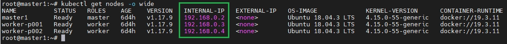
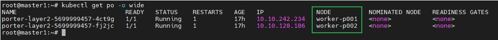
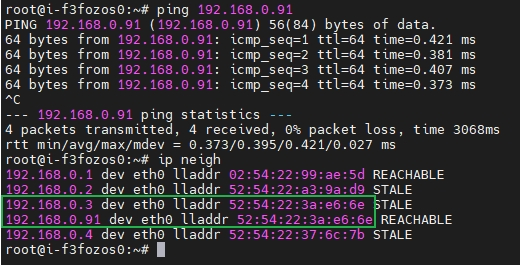
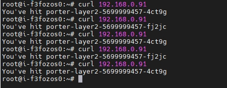
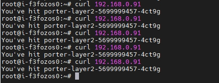

# Use Porter in Layer 2 Mode

This document demonstrates how to use Porter in Layer 2 mode to expose a service backed by two pods. The Eip, deployment and service described in this document are examples only and you need to customize the commands and YAML configurations based on your requirements.

For details about the network topology of Porter in Layer 2 mode, see [Layer 2 Mode Network Topology](./layer-2-mode-network-topology.md).

## Prerequisites

* You need to prepare a Kubernetes cluster where Porter has been installed. For details, see [Install Porter on Kubernetes (kubectl and Helm)](https://github.com/Patrick-LuoYu/porter/blob/configure-porter-for-multi-router-clusters-en/doc/install-porter-on-kubernetes.md) and [Install Porter on KubeSphere (Web Console)](https://github.com/Patrick-LuoYu/porter/blob/configure-porter-for-multi-router-clusters-en/doc/install-porter-on-kubesphere.md). All Kubernetes cluster nodes must be on the same Layer 2 network (under the same router).
* You need to prepare a client machine, which is used to verify whether Porter functions properly in Layer 2 mode. The client machine needs to be on the same network as the Kubernetes cluster nodes.

This document uses the following devices as an example:

| Device Name | IP Address  | MAC Address       | Description                 |
| ----------- | ----------- | ----------------- | --------------------------- |
| master1     | 192.168.0.2 | 52:54:22:a3:9a:d9 | Kubernetes cluster master   |
| worker-p001 | 192.168.0.3 | 52:54:22:3a:e6:6e | Kubernetes cluster worker 1 |
| worker-p002 | 192.168.0.4 | 52:54:22:37:6c:7b | Kubernetes cluster worker 2 |
| i-f3fozos0  | 192.168.0.5 | 52:54:22:fa:b9:3b | Client machine              |

## Step 1: Enable strictARP for kube-proxy

In Layer 2 mode, you need to enable strictARP for kube-proxy so that all NICs in the Kubernetes cluster stop answering ARP requests from other NICs and Porter handles ARP requests instead.

1. Log in to the Kubernetes cluster and run the following command to edit the kube-proxy ConfigMap:

   ```bash
   kubectl edit configmap kube-proxy -n kube-system
   ```

2. In the kube-proxy ConfigMap YAML configuration, set `data.config.conf.ipvs.strictARP` to `true`.

   ```yaml
   ipvs:
     strictARP: true
   ```
   
3. Run the following command to restart kube-proxy:

   ```bash
   kubectl rollout restart daemonset kube-proxy -n kube-system
   ```

## Step 2: Specify the NIC Used for Porter

If the node where Porter is installed has multiple NICs, you need to specify the NIC used for Porter in Layer 2 mode. You can skip this step if the node has only one NIC.

In this example, the master1 node where Porter is installed has two NICs (eth0 192.168.0.2 and eth1 192.168.1.2), and eth0 192.168.0.2 will be used for Porter.

Run the following command to annotate master1 to specify the NIC:

```bash
kubectl annotate nodes master1 layer2.porter.kubesphere.io/v1alpha1="192.168.0.2"
```

## Step 3: Create an Eip Object

The Eip object functions as an IP address pool for Porter.

1. Run the following command to create a YAML file for the Eip object:

   ```bash
   vi porter-layer2-eip.yaml
   ```

2. Add the following information to the YAML file:

   ```yaml
   apiVersion: network.kubesphere.io/v1alpha2
   kind: Eip
   metadata:
     name: porter-layer2-eip
   spec:
     address: 192.168.0.91-192.168.0.100
     interface: eth0
     protocol: layer2
   ```

   

   * The IP addresses specified in `spec.address` must be on the same network segment as the Kubernetes cluster nodes.

   * For details about the fields in the Eip YAML configuration, see [Configure IP Address Pools Using Eip](./configure-ip-address-pools-using-eip.md).

   

3. Run the following command to create the Eip object:

   ```bash
   kubectl apply -f porter-layer2-eip.yaml
   ```

## Step 4: Create a Deployment

The following creates a deployment of two pods using the luksa/kubia image. Each pod returns its own pod name to external requests. 

1. Run the following command to create a YAML file for the deployment:

   ```bash
   vi porter-layer2.yaml
   ```

2. Add the following information to the YAML file:

   ```yaml
   apiVersion: apps/v1
   kind: Deployment
   metadata:
     name: porter-layer2
   spec:
     replicas: 2
     selector:
       matchLabels:
         app: porter-layer2
     template:
       metadata:
         labels:
           app: porter-layer2
       spec:
         containers:
           - image: luksa/kubia
             name: kubia
             ports:
               - containerPort: 8080
   ```

3. Run the following command to create the deployment:

   ```bash
   kubectl apply -f porter-layer2.yaml
   ```

## Step 5: Create a Service

1. Run the following command to create a YAML file for the service:

   ```bash
   vi porter-layer2-svc.yaml
   ```

2. Add the following information to the YAML file:

   ```yaml
   kind: Service
   apiVersion: v1
   metadata:
     name: porter-layer2-svc
     annotations:
       lb.kubesphere.io/v1alpha1: porter
       protocol.porter.kubesphere.io/v1alpha1: layer2
   spec:
     selector:
       app: porter-layer2
     type: LoadBalancer
     ports:
       - name: http
         port: 80
         targetPort: 8080
     externalTrafficPolicy: Cluster
   ```

   

   * You must set `spec.type` to `LoadBalancer`.
   * The `lb.kubesphere.io/v1alpha1: porter` annotation specifies that the service uses Porter.
   * The `protocol.porter.kubesphere.io/v1alpha1: layer2` annotation specifies that Porter is used in Layer 2 mode.
   * If `spec.externalTrafficPolicy` is set to `Cluster` (default value), Porter randomly selects a node from all Kubernetes cluster nodes to handle service requests. Pods on other nodes can also be reached over kube-proxy.
   * If `spec.externalTrafficPolicy` is set to `Local`, Porter randomly selects a node that contains a pod in the Kubernetes cluster to handle service requests. Only pods on the selected node can be reached.

   

3. Run the following command to create the service:

      ```bash
      kubectl apply -f porter-layer2-svc.yaml
      ```

## Step 6: Verify Porter in Layer 2 Mode

The following verifies whether Porter functions properly.

1. In the Kubernetes cluster, run the following command to obtain the external IP address of the service:

   ```bash
   kubectl get svc porter-layer2-svc
   ```

   

2. In the Kubernetes cluster, run the following command to obtain the IP addresses of the cluster nodes:

   ```bash
   kubectl get nodes -o wide
   ```

   

3. In the Kubernetes cluster, run the following command to check the nodes of the pods:

   ```bash
   kubectl get po
   ```

   

   

   In this example, the pods are automatically assigned to different nodes. You can manually [assign pods to different nodes](https://kubernetes.io/docs/concepts/scheduling-eviction/assign-pod-node/).

   

4. On the client machine, run the following commands to ping the service IP address and check the IP neighbors:

   ```bash
   ping 192.168.0.91
   ```

   ```bash
   ip neigh
   ```

   

   In the output of the `ip neigh` command, the MAC address of the service IP address 192.168.0.91 is the same as that of worker-p001 192.168.0.3. Therefore, Porter has mapped the service IP address to the MAC address of worker-p001.

5. On the client machine, run the following command to access the service:

   ```bash
   curl 192.168.0.91
   ```

   If `spec.externalTrafficPolicy` in the [service YAML configuration](#step-5-create-a-service) is set to `Cluster`, both pods can be reached.

   

   If `spec.externalTrafficPolicy` in the [service YAML configuration](#step-5-create-a-service) is set to `Local`, only the pod on the node selected by Porter can be reached.

   